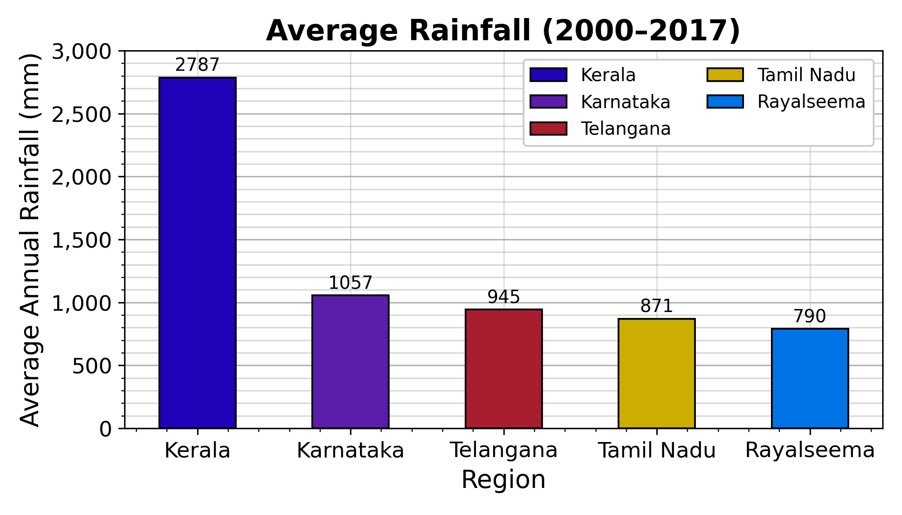
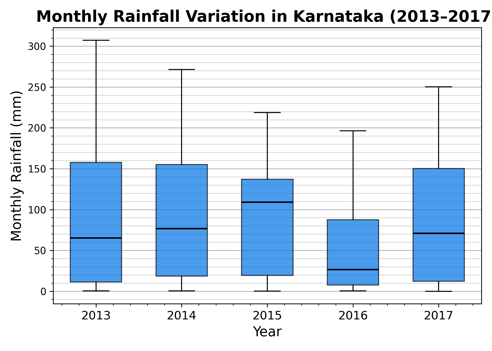
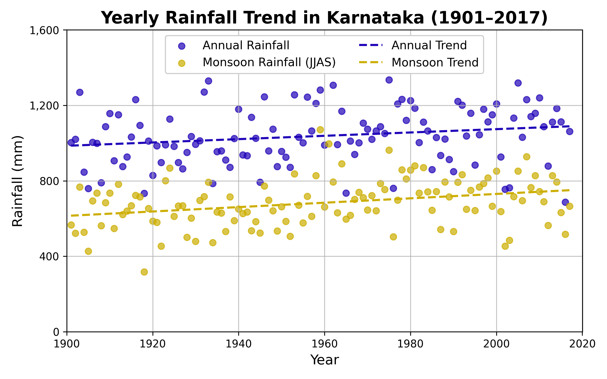

# The Sub-divisional Monthly Rainfall (1901–2017) Dataset

The dataset provides **timeseries rainfall data** for different regions in India (1901–2017).  
It includes **yearly, monthly, and seasonal** observations. Rain in Bangalore is interesting, fun, and sometimes annoying.  
The dataset is provided on the official government portal and analyzed in my **DS200 public repository**.

**Dataset:** [https://www.data.gov.in/resource/sub-divisional-monthly-rainfall-1901-2017](https://www.data.gov.in/resource/sub-divisional-monthly-rainfall-1901-2017)  
**Repo:** [https://github.com/Shiva-sai-krishna/DS200](https://github.com/Shiva-sai-krishna/DS200)

---

## Average Rainfall for the South Indian Regions

Many **South Indian states** experience massive rainfall.  
Let’s compare the rainfall observed in these regions through some plots — focusing on the **total annual rainfall** observed in recent years.

### Average Annual Rainfall (2000–2017)

  

---

## Analysis

We can observe that **Kerala** has the highest rainfall among the other sister states in South India —  
with the average total rainfall being **≈ 2787 mm**, and **Rayalaseema** receiving the least rainfall with an average of **≈ 790 mm**.

---

## Rainfall Variation for the Karnataka Region

The state of **Karnataka** (home to Bangalore) experiences different rainfall patterns across months.  
Let’s visualize this variation through a **box plot**.

### Box Plot — Monthly Rainfall Variation (2013–2017)

  

---

## Analysis

The rainfall observed for the **Karnataka** region varies within a year.  
For the years **2013–2017**, different rainfall levels are observed for different months —  
with some months having **0 mm** rainfall and peaks reaching **289 mm**,  
while the average rainfall hovers around **67 mm**.

---

## Rainfall Trend for the Karnataka Region

In recent years, rainfall levels in Karnataka have appeared quite low raising concerns about **water scarcity**.  
But is this an **edge case**, or a **steady trend**?  
Let’s visualize it with a **scatter plot** showing total yearly and monsoon rainfall.

### Scatter Plot — Rainfall Trends (1901–2017)

  

---

## Analysis

The **total yearly rainfall** and **monsoon rainfall (JJAS)** for the Karnataka region  
have been **steadly increasing** from **1901 to 2017** while also 
showing a **strong correlation** between the two patterns.

---
